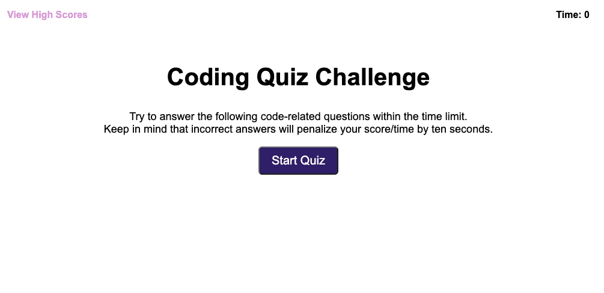

# JuSt_a_Quiz

This application is a timed javascript quiz. Users must complete a multiple choice quiz within the time limit. Incorrect answers result in the time remaining being shortened. Upon completion, a user's score is displayed and can be saved to local storage along with the players initials. Past scores can also be viewed.

## User Story

```
AS A coding boot camp student
I WANT to take a timed quiz on JavaScript fundamentals that stores high scores
SO THAT I can gauge my progress compared to my peers
```

## Acceptance Criteria

```
GIVEN I am taking a code quiz
WHEN I click the start button
THEN a timer starts and I am presented with a question
WHEN I answer a question
THEN I am presented with another question
WHEN I answer a question incorrectly
THEN time is subtracted from the clock
WHEN all questions are answered or the timer reaches 0
THEN the game is over
WHEN the game is over
THEN I can save my initials and score
```

## Screenshots of Application




## Deployed Application Can Be Found At:

https://cahillmichael.github.io/JuSt_a_Quiz/